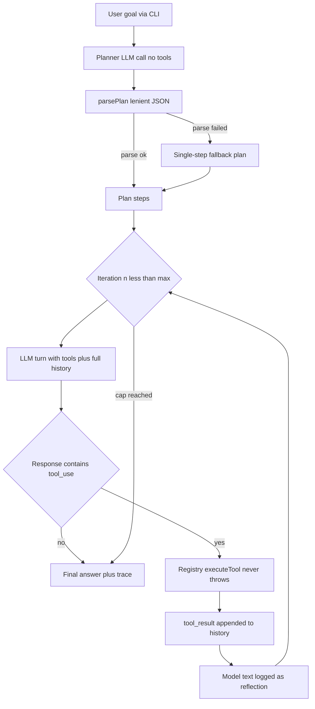

# Architecture

An AI-engineering-oriented walkthrough of how this agent is built, why it is built that way, and where it would break in production.

To **learn** the concepts and then extend them, start with [LEARNING.md](LEARNING.md). This file is the design rationale for _this_ branch (hand-written loop + streaming CLI).

## High-level system diagram

## Data flow through the loop

The unit of state is the **message history** (`ChatMessage[]`). Each iteration:

1. The full history is sent to the model along with the tool schemas.
2. The model replies with content blocks: `text` (reasoning/answer) and/or `tool_use` (a request to run a tool).
3. The assistant turn is appended to history **verbatim** — the Anthropic API requires `tool_use` blocks to be answered by matching `tool_result` blocks in the next user message, so we never mutate or filter the turn.
4. Each `tool_use` is executed; its output string becomes a `tool_result` block in a new user message.
5. Repeat until a turn contains no `tool_use` blocks (that turn's text is the answer) or the iteration cap fires.

Acting turns prefer `client.stream()` when the provider implements it (`messages.stream()` under the hood). Each `text_delta` is forwarded to `onToken` for live CLI rendering. Tokens are **not** stored in the trace. Planning still uses `complete()` so the JSON plan stays a single parseable blob. Clients that omit `stream()` (including the vitest FakeClient) keep working via `complete()`.

A parallel **trace** (`TraceEvent[]`) records every phase for the console and the final result. It is derived state — the model never sees it.

## Design decisions and why

### A hand-written loop instead of the SDK's `toolRunner`

`@anthropic-ai/sdk` ships `client.beta.messages.toolRunner()`, which runs this whole loop for you. We deliberately do **not** use it: the project's purpose is to make plan → act → observe → reflect visible and hackable. A hidden loop would defeat the point.

### Planning as a separate, tool-free LLM call

The planner gets its own prompt that demands pure JSON (`{"steps":[...]}`), separate from the acting prompt. Reasons:

- **Separation of concerns**: producing a machine-parseable artifact and doing free-form tool use are different jobs; one prompt doing both does both worse.
- **Testability**: `parsePlan` is a pure function, unit-tested without any API key.
- **Debuggability**: the plan is printed before any action, so you can see _what the agent thinks it is doing_ before it does it.

The plan is **advisory**, not enforced: it is injected into the first user message of the acting loop, but the model may skip or reorder steps. Enforcing plan adherence (e.g. a state machine that only allows the current step's tools) is a deliberate non-goal here.

### Native `tool_use` instead of parsing free text

Tools are declared to the API with JSON schemas, and the model returns structured `tool_use` blocks. This is far more reliable than asking the model to print `TOOL: calculator ARGS: {...}` and parsing it — the API constrains the output shape for us.

### Streaming vs `complete()`

The Anthropic client implements both. `complete()` is a single blocking `messages.create` — still used for the planner. `stream()` uses `messages.stream()` and a `StreamAssembler` that:

- forwards `text_delta` immediately (live tokens)
- buffers `input_json_delta` until `content_block_stop`, then emits one `tool_use`
- emits `message_complete` on `message_stop` (same shape as `complete()`)

**Backpressure:** the CLI pulls events with `for await`. If Ink is slow, the iterator pauses, which pauses reading the HTTP body. Ink itself buffers token deltas and flushes React state every ~50ms so we do not re-render on every token.

### The `LlmClient` seam

`src/agent/anthropic-client.ts` is the only file that imports the SDK. The loop depends on a small `LlmClient` interface with SDK-free types (`src/types`). Payoff: the entire loop is tested with a scripted `FakeClient` — no network, no key, deterministic — and swapping providers means writing one adapter.

### Tools never throw

`executeTool` converts every failure — unknown tool name, bad arguments, crash inside the tool — into an `Error: ...` string that goes back to the model as a normal observation. The philosophy: **the model is the error-recovery mechanism**. A thrown exception kills the run; an error observation lets the agent adapt. This is also why the calculator is a hand-written parser instead of `eval`: tool input is model-generated and must be treated as untrusted.

### State and memory per iteration

There is exactly one memory: the in-memory conversation history, which grows by one assistant turn and one tool-result turn per iteration. Nothing persists between runs. This is the simplest correct choice for a CLI demo and keeps the mental model clean: _what the model sees is all there is_.

### Sequential tool execution

When the model requests several tools in one turn, we run them in order, sequentially. Parallel execution would be faster but complicates the trace, error attribution, and the beginner-facing narrative. It is listed in the roadmap.

## Failure modes considered

| Failure mode                                                  | How it is handled                                                                                                                                                                |
| ------------------------------------------------------------- | -------------------------------------------------------------------------------------------------------------------------------------------------------------------------------- |
| **Infinite loop** (model keeps calling tools forever)         | Hard `AGENT_MAX_ITERATIONS` cap (default 8). On hitting it, the agent returns the best answer-so-far with a warning, and the CLI exits with code 2.                              |
| **Malformed plan** (model ignores the JSON instruction)       | `parsePlan` tries fenced blocks, raw JSON, then the first `{...}` in the text. If all fail: single-step fallback plan + a `[warn]` trace event. The run degrades, never crashes. |
| **Hallucinated tool** (model calls a tool that doesn't exist) | The registry returns `Error: unknown tool "X". Available tools: ...` as an observation, so the model can self-correct on the next turn.                                          |
| **Malformed tool arguments**                                  | Each tool validates its own input and returns `Error: ...` strings (e.g. calculator rejects non-string `expression`).                                                            |
| **Tool crashes**                                              | `executeTool` wraps every call in try/catch and converts exceptions into error observations.                                                                                     |
| **Missing API key**                                           | The CLI fails fast at startup with a clear message, before any API call.                                                                                                         |
| **Empty final answer** (model ends its turn with no text)     | The loop substitutes an explicit "finished without a final text answer" message.                                                                                                 |
| **No max-iteration safeguard**                                | Considered and rejected as a design option — the cap is mandatory, not opt-in.                                                                                                   |
| **Giant tool output flooding the console**                    | Observations are truncated to 500 chars _for display only_; the model still receives the full output.                                                                            |

## What's missing / not production-ready

This branch teaches the loop and streaming. It does **not** include:

- Persistent memory (history dies with the process)
- Retry/backoff or rate-limit handling (a 429 fails the run)
- Token/cost tracking or a budget cap (we ignore provider `usage`)
- Zod (or any schema) at the registry — each tool validates itself
- Eval of answer quality (FakeClient tests mechanics only)
- Guardrails / final-answer contracts
- Parallel tool execution
- OpenTelemetry (the console trace is for humans)
- Sandboxing (tools are in-process with full Node privileges — safe only because they are pure)
- Multi-agent orchestration
- Human-in-the-loop for side effects (there are no side-effecting tools yet)
- Treating tool output as untrusted (prompt injection via observations)

How to take each idea into a real app is the table in [LEARNING.md](LEARNING.md) Part 2, not a second copy here.

## From this demo to production (short)

Keep: inspectable loop, native tools, error-as-observation, `LlmClient` seam, FakeClient tests, hard iteration cap, abort, streaming backpressure.

Change first: schema-validate args **before** `execute`; cap tokens and wall time; persist history without splitting `tool_use`/`tool_result`; retry 429/5xx only.

Add before any write tool: HITL, timeouts, sandbox, idempotency, structured traces.

Optional later in this repo: loop-engineering PR (retry, budget, fingerprint, trim, Zod) and HITL booking PR (workflow + y/n). Read those after this branch's concept map is solid.
