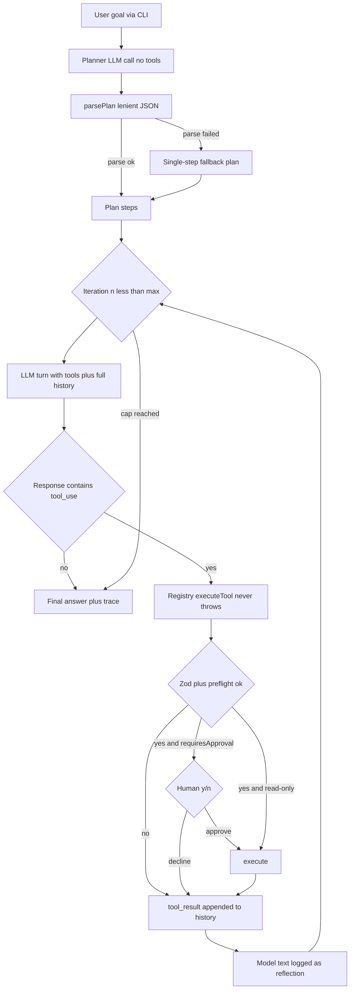

# Architecture

An AI-engineering-oriented walkthrough of how this agent is built, why it is built that way, and where it would break in production.

If you want the **curriculum** (what to run, what each file teaches), start with [LEARNING.md](LEARNING.md). This document is the design rationale.

## High-level system diagram

## Data flow through the loop

The unit of state is the **message history** (`ChatMessage[]`). Each iteration:

1. The full history is sent to the model along with the tool schemas.
2. The model replies with content blocks: `text` (reasoning/answer) and/or `tool_use` (a request to run a tool).
3. The assistant turn is appended to history **verbatim** — the Anthropic API requires `tool_use` blocks to be answered by matching `tool_result` blocks in the next user message, so we never mutate or filter the turn.
4. Each `tool_use` is executed; its output string becomes a `tool_result` block in a new user message.
5. Repeat until a turn contains no `tool_use` blocks (that turn's text is the answer) or the iteration cap fires.

Acting turns prefer `client.stream()` when the provider implements it (`messages.stream()` under the hood). Each `text_delta` is forwarded to `onToken` for live CLI rendering. Tokens are **not** stored in the trace. Planning still uses `complete()` so the JSON plan stays a single parseable blob. Clients that omit `stream()` (including the vitest FakeClient) keep working via `complete()`.

A parallel **trace** (`TraceEvent[]`) records every phase for the console and the final result. It is derived state — the model never sees it. Trace types: `plan`, `act`, `observe`, `reflect`, `approve`, `warning`, `answer`.

## Registry pipeline

`executeTool` is the only way a tool runs. Order is the HITL lesson:

1. **Unknown name** → `Error: unknown tool "…"`. The model can recover.
2. **Zod `argsSchema`** → invalid JSON types never reach `execute` or the human.
3. **`preflight`** → domain rules (unknown `fare_id`, fare not quoted). Still no HITL.
4. **`requiresApproval`** → `onApprove`. Missing callback / non-TTY without `--yes` → **deny**.
5. **`execute`** → wrapped in try/catch; crashes become error strings.

Decline and preflight failures are ordinary `tool_result` text. The loop does not special-case them beyond emitting `[approve]` / `[warn]` on the trace.

## Design decisions and why

### A hand-written loop instead of the SDK's `toolRunner`

`@anthropic-ai/sdk` ships `client.beta.messages.toolRunner()`, which runs this whole loop for you. We deliberately do **not** use it: the project's purpose is to make plan → act → observe → reflect visible and hackable. A hidden loop would defeat the point.

### Planning as a separate, tool-free LLM call

The planner gets its own prompt that demands pure JSON (`{"steps":[...]}`), separate from the acting prompt. Reasons:

- **Separation of concerns**: producing a machine-parseable artifact and doing free-form tool use are different jobs; one prompt doing both does both worse.
- **Testability**: `parsePlan` is a pure function, unit-tested without any API key.
- **Debuggability**: the plan is printed before any action, so you can see _what the agent thinks it is doing_ before it does it.

The plan is **advisory**, not enforced: it is injected into the first user message of the acting loop, but the model may skip or reorder steps. Enforcing plan adherence (e.g. a state machine that only allows the current step's tools) is a deliberate non-goal here.

### Native `tool_use` instead of parsing free text

Tools are declared to the API with JSON schemas, and the model returns structured `tool_use` blocks. This is far more reliable than asking the model to print `TOOL: calculator ARGS: {...}` and parsing it — the API constrains the output shape for us.

### Streaming vs `complete()`

The Anthropic client implements both. `complete()` is a single blocking `messages.create` — still used for the planner. `stream()` uses `messages.stream()` and a `StreamAssembler` that:

- forwards `text_delta` immediately (live tokens)
- buffers `input_json_delta` until `content_block_stop`, then emits one `tool_use`
- emits `message_complete` on `message_stop` (same shape as `complete()`)

**Backpressure:** the CLI pulls events with `for await`. If Ink is slow, the iterator pauses, which pauses reading the HTTP body. Ink itself buffers token deltas and flushes React state every ~50ms so we do not re-render on every token.

### The `LlmClient` seam

`src/agent/anthropic-client.ts` is the only file that imports the SDK. The loop depends on a small `LlmClient` interface with SDK-free types (`src/types`). Payoff: the entire loop is tested with a scripted `FakeClient` — no network, no key, deterministic — and swapping providers means writing one adapter.

### Loop engineering

The prompt can _ask_ the model not to repeat itself. The loop now _enforces_ a few cheap invariants (see `src/agent/loop-guards.ts`):

- **Retry** 429 / 5xx with exponential backoff. Never retry 400 — that is our bug.
- **Token budget** (`AGENT_TOKEN_BUDGET`) sits next to the iteration cap. Usage comes from the provider when present.
- **Stuck-loop** — same tool name + same args is not executed again; the model gets an error observation instead.
- **History trim** — keep the goal message plus the last N assistant/user pairs so we never split `tool_use` from `tool_result`.
- **Zod at the registry** — invalid tool args never reach `execute`.
- **HITL** — `requiresApproval` tools pause after Zod/preflight. Decline is an error observation; the stuck-call fingerprint then blocks retrying the same args.

### A mock airline desk (search → quote → book)

The calculator/time/search tools are one-shot Q&A. The airline tools are a **workflow**: the model must carry a `fare_id` through history, quote before booking, and wait for a human on the only write. Catalog, quotes, and PNRs live in process memory (`resetAirlineStore` in tests). There is no payment, GDS, or email — the lesson is the gate, not aviation.

Why those six flights exist (morning under $400, over-cap afternoon, wrong date/origin/destination) is tabulated in [LEARNING.md](LEARNING.md). `book_flight` is the only tool with `requiresApproval: true`. Search and quote are cheap on purpose so the human is only asked at the irreversible step.

### Tools never throw

`executeTool` converts every failure — unknown tool name, bad arguments, crash inside the tool — into an `Error: ...` string that goes back to the model as a normal observation. The philosophy: **the model is the error-recovery mechanism**. A thrown exception kills the run; an error observation lets the agent adapt. This is also why the calculator is a hand-written parser instead of `eval`: tool input is model-generated and must be treated as untrusted.

### State and memory per iteration

There is exactly one memory **the model sees**: the in-memory conversation history, which grows by one assistant turn and one tool-result turn per iteration. The airline module also keeps a process-local quote/PNR table so `book_flight` can be stateful; the model only learns about it through observations. Nothing persists between process runs.

### Sequential tool execution

When the model requests several tools in one turn, we run them in order, sequentially. Parallel execution would be faster but complicates the trace, error attribution, and the beginner-facing narrative. It is listed in the roadmap.

## Failure modes considered

| Failure mode                                                  | How it is handled                                                                                                                                                                |
| ------------------------------------------------------------- | -------------------------------------------------------------------------------------------------------------------------------------------------------------------------------- |
| **Infinite loop** (model keeps calling tools forever)         | Hard `AGENT_MAX_ITERATIONS` cap (default 8). On hitting it, the agent returns the best answer-so-far with a warning, and the CLI exits with code 2.                              |
| **Malformed plan** (model ignores the JSON instruction)       | `parsePlan` tries fenced blocks, raw JSON, then the first `{...}` in the text. If all fail: single-step fallback plan + a `[warn]` trace event. The run degrades, never crashes. |
| **Hallucinated tool** (model calls a tool that doesn't exist) | The registry returns `Error: unknown tool "X". Available tools: ...` as an observation, so the model can self-correct on the next turn.                                          |
| **Malformed tool arguments**                                  | Zod `argsSchema` in the registry returns `Error: invalid arguments...` before `execute`. Tools may still validate domain rules (e.g. division by zero).                          |
| **Unknown / unquoted fare**                                   | `preflight` returns an error **before** the HITL prompt, so the human is never asked to approve garbage.                                                                         |
| **Side-effecting tool (book_flight)**                         | Registry asks `onApprove`. CLI: `y/n` or `--yes`. Tests inject a callback. Missing approver = deny. Decline is an observation; identical retries are fingerprinted.              |
| **HTTP 429 / 5xx from the LLM**                               | `withRetry` retries a few times with backoff. 400 is not retried.                                                                                                                |
| **Repeated identical tool calls**                             | Fingerprint of name+args; the second call is blocked and observed as an error.                                                                                                   |
| **Unbounded history**                                         | Oldest complete turns are dropped (`AGENT_KEEP_LAST_TURNS`).                                                                                                                     |
| **Token spend**                                               | Optional cumulative budget; stop with a partial answer, same shape as the iteration cap.                                                                                         |
| **Tool crashes**                                              | `executeTool` wraps every call in try/catch and converts exceptions into error observations.                                                                                     |
| **Missing API key**                                           | The CLI fails fast at startup with a clear message, before any API call.                                                                                                         |
| **Empty final answer** (model ends its turn with no text)     | The loop substitutes an explicit "finished without a final text answer" message.                                                                                                 |
| **No max-iteration safeguard**                                | Considered and rejected as a design option — the cap is mandatory, not opt-in.                                                                                                   |
| **Giant tool output flooding the console**                    | Observations are truncated to 500 chars _for display only_; the model still receives the full output.                                                                            |

## What's missing / not production-ready

- **No persistent memory or vector store** — history lives in RAM for one run; trim only keeps a window, it does not persist across runs. Airline quotes/PNRs reset when the process exits.
- **Retry is only for LLM HTTP 429/5xx** — no retry of tool execution, no rate-limit scheduler beyond backoff.
- **No eval harness or regression tests for agent behavior** — unit tests cover tools, parsing, loop mechanics, HITL approve/deny, and the stream mapper with a fake LLM, but nothing measures end-to-end answer quality against real model outputs.
- **No guardrails or output validation** — the final answer is returned unchecked; there is no schema validation, content filtering, or factuality check.
- **No concurrency or parallel tool execution** — tools run one at a time, in order.
- **No observability/tracing** (e.g. OpenTelemetry) — the console trace is for humans; there are no spans, metrics, or structured logs.
- **No sandboxing for tool execution** — tools run in-process with full Node.js privileges. Safe today only because tools are in-memory mocks; a `bash` or `fs` tool would be dangerous.
- **Single-agent only** — no multi-agent patterns, orchestration, or delegation.
- **HITL is CLI y/n (or `--yes`)** — no durable approval queue, no timeout, no per-tool policy beyond `requiresApproval`.
- **Weak error recovery for unexpected LLM output** — unknown content block types are collapsed to empty text; a truly malformed API response would surface as a confusing answer rather than a structured error.

## If I were to productionize this

- Add retry with exponential backoff and rate-limit-aware scheduling around API calls. **Done** for 429/5xx inside the loop (not a full scheduler).
- Track token usage and cost per run; add a budget cap alongside the iteration cap. **Done** for a cumulative token budget (not dollar cost).
- Validate tool inputs with Zod schemas generated from the tool definitions; validate final answers against an output contract. **Done** for tool args; final answers still unchecked.
- Run independent tool calls in parallel (`Promise.all`) with per-tool timeouts.
- Instrument with OpenTelemetry: one span per LLM call and per tool execution.
- Sandbox tool execution (subprocess, container, or WASM) before adding any tool that touches the filesystem, network, or shell.
- Add a human-in-the-loop approval step for tools marked as side-effecting. **Done** for `book_flight` (CLI y/n / `--yes` / injected `onApprove`).
- Support multi-agent orchestration (planner/executor/critic roles) once single-agent behavior is well-tested.
