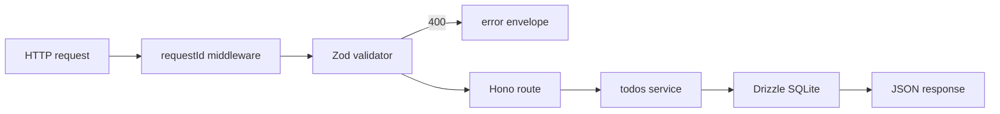

# Architecture

Learning notes for the todos API: why these libraries, how a request flows, and what we deliberately left out.

## Request flow

1. `requestId` stamps every request (`X-Request-Id` in, UUID if missing) so logs and error bodies correlate.
2. `zValidator` parses params/body. Invalid input never reaches the service — that is the whole point of a schema at the edge.
3. The service talks to Drizzle. `404` is thrown as `HTTPException`; `onError` turns every failure into `{ error, requestId }`.

`createApp(db)` is a factory. Tests pass `:memory:` SQLite; the process in `src/index.ts` passes a file path. Same routes, no network.

## Design decisions

- **Hono over Express** — small, TypeScript-first, `app.request()` for tests without `supertest` or a listening port.
- **Zod at the HTTP boundary, not in the database layer** — the service trusts its typed arguments. One schema per endpoint keeps error messages close to the wire format.
- **Drizzle + SQL file** — the ORM gives typed queries; the `.sql` file is readable without generating a mystery snapshot. `IF NOT EXISTS` makes boot idempotent for a learning project (a real app would use a migrations journal).
- **SQLite** — no Docker required for the API itself. WAL mode is on for slightly saner concurrent reads.
- **UUIDs as text PKs** — no autoincrement surprises when we later enqueue jobs keyed by todo id.

## Failure modes

| Failure                 | Handling                                             |
| ----------------------- | ---------------------------------------------------- |
| Invalid JSON / Zod fail | 400 + `{ error, requestId }`                         |
| Unknown todo id         | 404                                                  |
| Non-UUID `:id`          | 400 (param schema)                                   |
| Unexpected throw        | 500, stack logged with requestId                     |
| Missing data directory  | `src/index.ts` creates `data/` before opening SQLite |

## What's missing / not production-ready

- No authentication or authorization
- No pagination, filtering, or optimistic concurrency
- No Postgres / connection pooling
- No structured request logs (method, path, duration)
- No OpenAPI spec
- No rate limiting
- SQLite file is a single point of failure; not for multi-instance deploys
- Migration strategy is "run the SQL on boot", not a versioned migrator with down migrations

## If I were to productionize this

- Move to Postgres + `drizzle-kit migrate` with a migrations table
- Add auth (session or JWT) and per-user todos
- Emit JSON logs and an OpenTelemetry trace per request
- Publish OpenAPI from the Zod schemas
- Add pagination and `If-Match` / `updated_at` for safe PATCH
